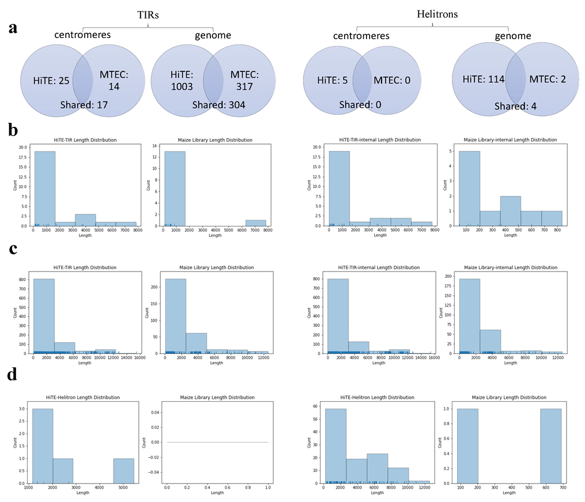

# Benchmarking results of HiTE

## TE annotation libraries used in the benchmarking of HiTE
The TE libraries generated by HiTE, RepeatModeler2, EDTA, and RepeatScout are located in the directories:
* `benchmark/HiTE_lib`
* `benchmark/rm2_lib`
* `benchmark/EDTA_lib`
* `benchmark/RS_lib`

## Novel TIR elements of Rice
1. HiTE discovers over 1000 novel TIR elements of rice with well-defined structures that are not included in known libraries, stored in the directory `novel_tir_rice`.
2. You can find the multiple sequence alignment files for each of the novel TIR elements in `novel_tir_rice/msa.zip` file, and the structural definitions for each transposon in the `data.xlsx` file.
3. With these information, you can easily determine the structural features of novel TIR elements and validate their reliability. The following figure shows a novel TIR transposons identified by HiTE, visualized using MEGA.

## Novel TIR and Helitron elements in the centromeres of Maize
1. We conducted a comparative analysis between HiTE and the [Maize TE Consortium (MTEC)](https://github.com/oushujun/MTEC) library on TIR and Helitron transposons in centromeres of a complete telomere-to-telomere assembly of the maize genome ([doi:10.1038/s41588-023-01419-6](https://doi.org/10.1038/s41588-023-01419-6)), as shown in the following figure.
2. The positions of novel TIR and Helitron elements in the centromere (`data.xlsx`), along with their multiple sequence alignment results (`*_msa.zip`), are stored in the directory `novel_tir_helitron_maize_centromeres`.

## RepeatMasker_Lib.zip
`RepeatMasker_Lib.zip` is used to replace the Dfam library in RepeatMasker, refer to [this page](https://github.com/CSU-KangHu/HiTE#classified) for more information.
